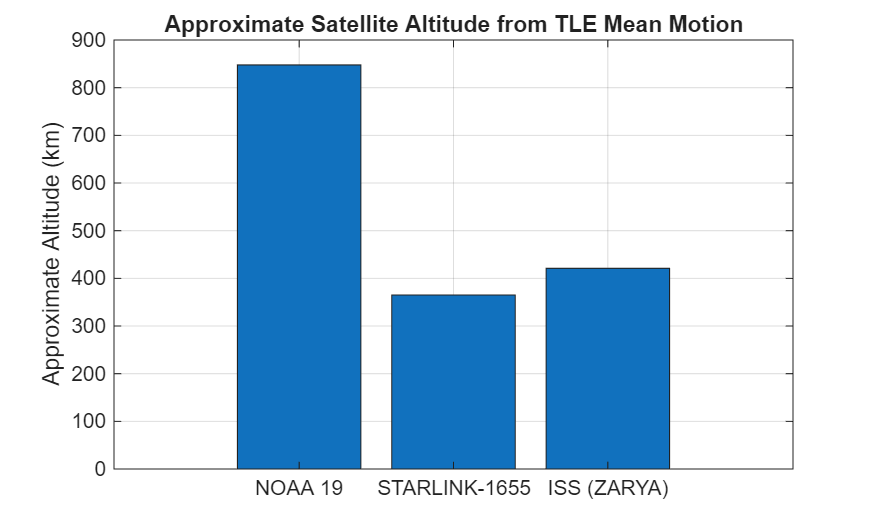
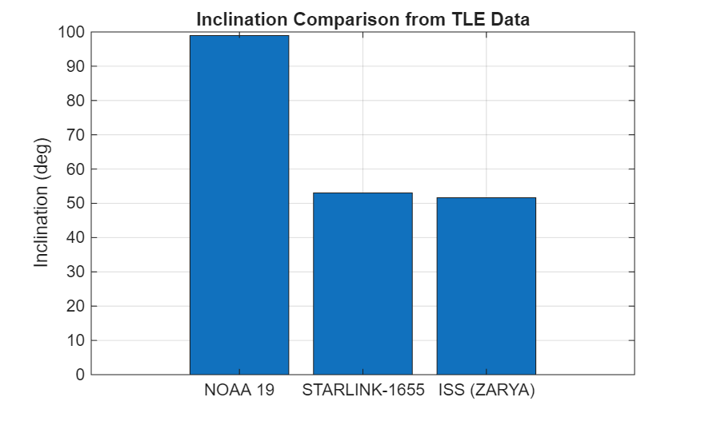
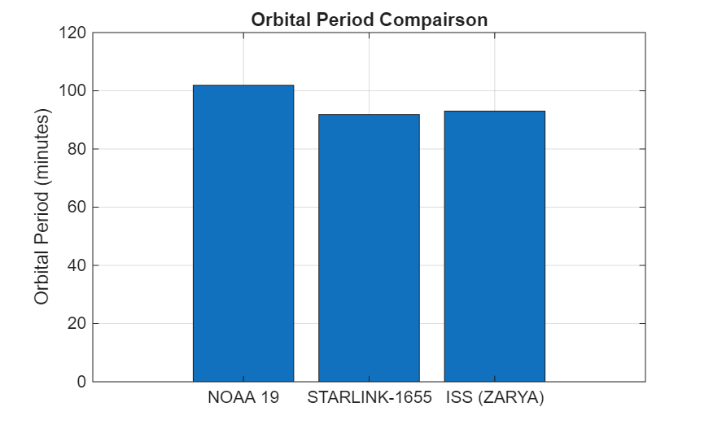

# Orbital-Data-Analysis
Analyzed and developed a MATLAB-based analysis of real satellite TLE data to extract orbital parameters and evaluate mission objectives' influence on inclination, altitude, and orbital period
## Overview
 - Extract orbital parameters from real TLE data
 - Compute orbital altitude and period using Kepler's relation
 - Compare differences between communication, weather, and crewed satellites
## Satellites Analyzed
 - NOAA 19 (weather satellite)
 - STARLINK-1655 (communication satellite)
 - ISS (ZARYA)
## Methods
 - Parsed TLE data in MATLAB
 - Converted mean motion to rad/s
 - Computed orbital altitude and period
 - Generated plots for compairson
## Results
This analysis shows that
 - NOAA operates in a high-altitude, near-polar orbit for global coverage
 - STARLINK operates at a lower altitude for reduced communication delays
 - The ISS balances accessibility and coverage with mid-inclination orbit
## Files
 - 'Orbital_Period_Analysis.mat' MATLAB CODE
 - 'Analysis of Orbital Parameters Using Real World Tw2.pdf' Full Report
 - Plots are included in both code and report
## Example Results
### Altitude

### Inclination

### Orbital Period

## Tools Used
 - MATLAB
 - Public TLE Data (CelesTrak)
 - AI Copilot Gemini
